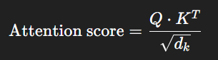
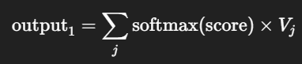
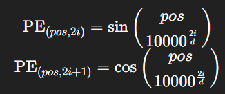
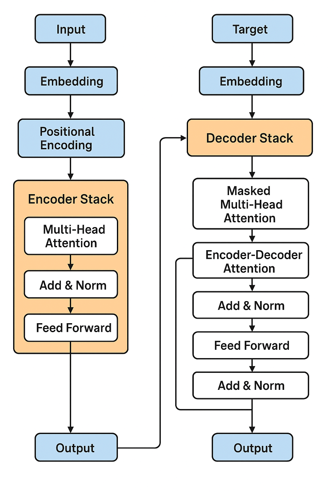

# Konsep Dasar Transformer

* Attention Mechanism
    * Fokus ke bagian penting dari input
    * Tipe: Scaled Dot-Product Attention, Self-Attention

* Positional Encoding
    * Karena Transformer gak punya urutan seperti RNN, perlu info posisi

* Encoder & Decoder
    * Encoder: memahami input
    * Decoder: menghasilkan output step-by-step

* Layer Normalization, Residual Connection, Feed Forward

## Arsitektur Transformer (Standard)

* Multi-Head Attention
    * Attention dilakukan beberapa kali secara paralel

* Stacking Layer
    * Encoder dan decoder di-stack berlapis-lapis (biasanya 6)

* Input & Output Processing
    * Tokenization → Embedding → Positional Encoding

## Implementasi Mini Transformer dari Nol

* Mulai dari:
    * Positional Encoding
    * Attention
    * Encoder Layer
    * Decoder Layer
    * Transformer end-to-end

## Varian Transformer Populer

*Turunan Transformer yang jadi dasar LLM modern*

* BERT (Bidirectional Encoder Representations from Transformers)
    * Hanya pakai encoder
    * Untuk understanding (QnA, sentiment analysis)

* GPT (Generative Pretrained Transformer)
    * Hanya pakai decoder
    * Untuk generation (text generation, chatbots)

* T5, XLNet, RoBERTa, LLaMA, PaLM, dll.

## Dari Transformer ke LLM

*Bagaimana model besar seperti GPT-3, GPT-4 terbentuk*

* Dataset sangat besar (Common Crawl, Wikipedia, Books, Code)
* Training di GPU/TPU skala besar (bahkan ratusan ribu core)
* Fine-tuning dan Reinforcement Learning with Human Feedback (RLHF)
* Prompt engineering jadi penting

## Aplikasi & Eksperimen Sederhana

*Coba gunakan atau fine-tune model open source*

* Pakai HuggingFace: transformers library
* Fine-tune GPT2, BERT, T5 untuk:
    * Chatbot
    * Translation
    * Summarization
    * Classification

# Penjelasan Konsep Dasar


## Attention Mechanism


1. 🧠 Self-Attention (dan Scaled Dot-Product Attention)

Bayangin kamu baca kalimat: *“The animal didn’t cross the street because it was too tired.”*

Kata “it” bisa merujuk ke “animal” atau “street”. Self-attention membantu model untuk memperhatikan kata mana yang relevan dengan “it”, berdasarkan konteks seluruh kalimat.

* 💡 Ide dasarnya: Setiap kata melihat ke semua kata lain, lalu menimbang seberapa penting masing-masing kata.

* Proses teknisnya (Scaled Dot-Product Attention):

    Misalnya kita punya kalimat: *"I love NLP"*\
    * Setiap kata akan diubah ke token lalu dikonversi jadi 3 vektor:
        1. Q (Query)
        2. K (Key)
        3. V (Value)
    
    contoh:

    ```bash
    "I"    → Q1, K1, V1  
    "love" → Q2, K2, V2  
    "NLP"  → Q3, K3, V3
    ```

    * Hitung skor Attention:

        

        Skor ini lalu diproses dengan softmax → hasilnya bobot (berapa besar perhatian ke kata lain).

    * Softmax → jadi bobot        
    * Bobot dikalikan dengan Value (V)

        

    **Hasil akhir: representasi baru dari kata "I" yang sudah “memperhatikan” semua kata dalam kalimat.**


2. 🧠 Multi-Head Attention

*Multi-head attention = beberapa self-attention dilakukan paralel, dengan sudut pandang berbeda.* 

Contoh:
* Head 1 fokus ke kata-kata sebelum
* Head 2 fokus ke kata setelah
* Head 3 fokus ke subjek
* Head 4 fokus ke objek
* Dsb

*Setiap head punya Q, K, V berbeda → hasil akhirnya digabung dan diproses lagi.*

**Hasil dari semua head digabungkan dan diproses ulang.**


## Positional Encoding

* Masalah: Transformer gak punya “rasa urutan” seperti RNN.

* Solusi: Tambahkan positional encoding ke input token. Misal contohnya memiliki kata berikut: 

    | Kata      | Posisi    | Embedding     | Positional Encoding   | Gabungan      |
    |-----------|-----------|---------------|-----------------------|---------------|
    | "I"       | 0         | [0.1, 0.3]    | [0.01, 0.02]          | [0.11, 0.32]  |
    | "love"    | 1         | [0.5, 0.2]    | [0.03, 0.04]          | [0.53, 0.24]  |


    * Positional Encoding (versi sinus-cosinus), Untuk posisi 𝑝𝑜𝑠 dan dimensi 𝑖:

        

    **Ini bikin model tahu mana kata yang datang duluan, walaupun prosesnya paralel.**


## Encoder & Decoder

Bayangin Transformer seperti sistem komunikasi:
* 🎤 Encoder = si penyampai pesan (mengerti isi)
* 🧠 Decoder = si penerima pesan (mengeluarkan respon/kata)


### Encoder

* Dapat input, Misalnya input kita: **"Saya makan nasi"**

    * Processnya:

    1. Tokenisasi + embedding → ubah kata jadi vektor
    2. Tambahkan positional encoding
    3. Masuk ke Encoder Layer (biasanya berjumlah 6–12 layer), Di setiap layer encoder, ada:

        1. 🧠 Multi-head attention (self-attention): masing-masing kata melihat kata lain dalam input
        2. 🧮 Feed Forward Network (FFN): semacam jaringan saraf kecil
        3. ➕ Residual Connection (penjelasan nanti di poin 5)
        4. 🔃 Layer Normalization


### Decoder

* Ambil output encoder dan target sebelumnya, Misalnya kita mau translate:

    * Processnya: 

    1. Input awal decoder biasanya "<start>" token.
    2. Di setiap langkah, decoder pakai:
        * 🧠 Masked multi-head attention (self-attention) → biar gak lihat token berikutnya
        * 🧮 Encoder-decoder attention → fokus ke bagian input yang penting
        * ➕ Feed Forward Network (FFN) → seperti di encoder
        * 🔃 Layer normalization + residual connection

    * Berikut Visualisasinya: 
    ```bash
    Langkah 1: <start> → "I"  
    Langkah 2: <start> "I" → "eat"  
    Langkah 3: <start> "I eat" → "rice"
    ```

    * 🔐 Kenapa masked self-attention?
    Agar saat model menghasilkan kata ke-2, dia gak tahu dulu kata ke-3.
    Ini penting supaya model belajar prediksi seperti manusia (tanpa bocoran masa depan).

### 🔁 Komponen Pendukung

* Residual Connection → menghindari gradient hilang (shortcut) → Residual = informasi lama + informasi baru

    ```bash
    Output = Input + Output dari Layer
    ```

* Layer Normalization → stabilisasi training

* Contoh Flow Sederhana dalam 1 Layer Encoder: 
```bash
Input Word → 
    Positional Encoding →
        Multi-Head Attention →
        + Residual Connection →
            LayerNorm →
                Feed Forward →
                    + Residual Connection →
                        LayerNorm →
                            → Output
```


### Summary Visual
```bash
Input --> Embedding --> Positional Encoding
           |
        Encoder Stack
           |
        --> Output ke Decoder
                             |
     Target --> Embedding --> Decoder Stack --> Output Token
```




## Output dan Parameter Transformer

### Output dari Transformer

Hasil akhir dari decoder:
* Bentuknya vektor (bukan langsung kata)
* Vektor ini masuk ke linear layer → softmax
* Softmax memilih kata dengan probabilitas tertinggi


### Jumlah Parameter

Transformer punya banyak parameter karena:
* Banyak layer (encoder + decoder)
* Banyak head dalam multi-head attention
* Embedding + positional encoding + FFN

**Contoh GPT dan BERT bisa punya ratusan juta sampai miliaran parameter.**

### Ringkasan Arsitektur Transformer

| Komponen              | Fungsi                            |
|-----------------------|-----------------------------------|
| Embedding             | Ubah kata jadi vektor             |
| Positional Encoding   | Beri info urutan                  |
| Encoder Stack         | Pahami seluruh konteks input      |
| Decoder Stack         | Hasilkan output satu per satu     |
| Attention             | Fokus ke bagian penting           |
| FFN                   | Transformasi vektor               |
| Add & Norm            | Stabilkan dan jaga informasi lama |
| Output Softmax        | Prediksi token berikutnya         |


# REFERENCE / NOTE
1. ([All you need to know about ‘Attention’ and ‘Transformers Pt. 1](https://medium.com/data-science/all-you-need-to-know-about-attention-and-transformers-in-depth-understanding-part-1-552f0b41d021))
2. ([All you need to know about ‘Attention’ and ‘Transformers Pt. 2](https://medium.com/data-science/all-you-need-to-know-about-attention-and-transformers-in-depth-understanding-part-2-bf2403804ada))
3. ([Build your own transformer from scratch with PyTorch](https://medium.com/data-science/build-your-own-transformer-from-scratch-using-pytorch-84c850470dcb))